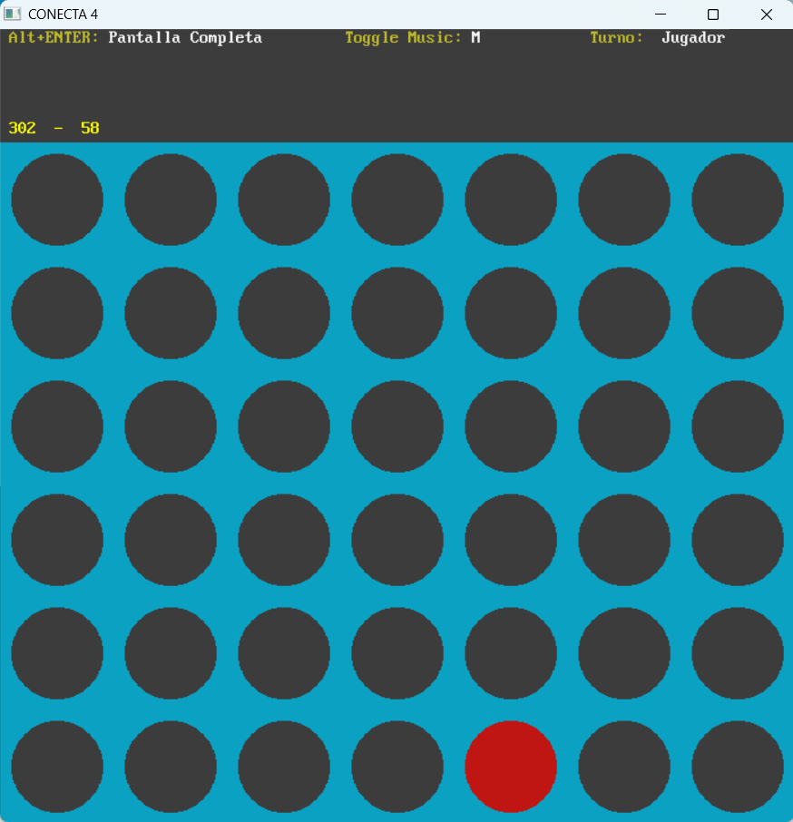

Juego en Basic QB64 <strong>Conecta 4</strong>

<i>El proyecto se compone de un único archivo conecta4.bas<i>
<i>y los archivos de sonido (todo en el directorio raiz)<i>
<i>Para crear un ejecutable .exe sólo hay que abrir dentro<i>
<i>de QB64 el archivo conecta4.bas y ejecutarlo o bien<i>
<i>opción make-EXE-file (en ambas se creará un .exe)<i>

